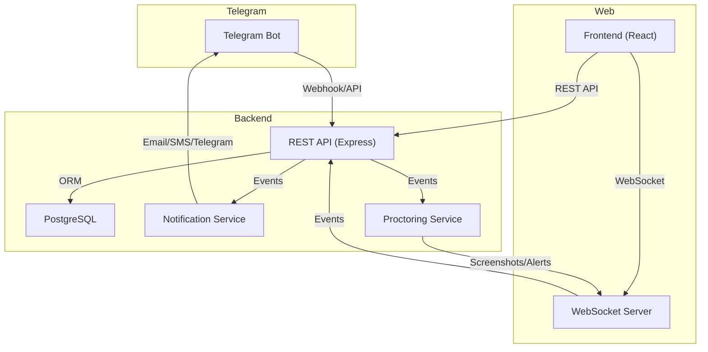

# CBT System Architecture

## Overview

The CBT system is a full-stack application with:
- **Backend:** Node.js (Express), PostgreSQL, Sequelize ORM, Telegram bot, Socket.IO for proctoring
- **Frontend:** React (SPA), connects via REST API and WebSocket
- **Proctoring:** Real-time via WebSocket (screenshots, tab-switch events)
- **Notifications:** Email, Telegram

## Diagram

## Key Components
- **API:** Handles authentication, exam logic, admin, analytics, notifications
- **Bot:** Teachers set up exams, upload questions, get notifications
- **WebSocket:** Real-time proctoring, alerts, screen mirroring
- **Database:** Stores users, exams, questions, answers, logs, proctoring events 